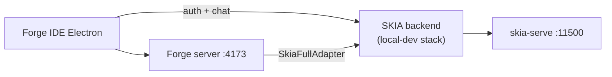

# Run SKIA Forge locally

Guide for running **SKIA Forge IDE** against the same local SKIA intelligence stack as `Skia-FULL/local-dev/` — without modifying production deployment or Northflank env.

## Overview



Forge does **not** embed intelligence locally. All cognition, doctrine, persona, and capability execution remain on the SKIA backend you point at.

---

## 1. Start the local SKIA backend

From `Skia-FULL`:

```bash
cp local-dev/.env.local.example local-dev/.env.local
./local-dev/scripts/start-all-local.sh
./local-dev/scripts/check-local-health.sh
```

Confirm:

- http://localhost:4000/api/local/health
- http://localhost:11500/api/health

---

## 2. Configure Forge for local mode

```bash
cd SKIA-Forge
cp local-dev/.env.forge.local.example local-dev/.env.forge.local
```

Key values:

```env
LOCAL_SKIA_BACKEND_URL=http://localhost:3000
LOCAL_SKIA_SERVE_URL=http://localhost:11500
LOCAL_EMBEDDING_ENGINE_URL=http://localhost:5003
LOCAL_VECTOR_DB_URL=http://localhost:5004
LOCAL_VIDEO_SERVICE_URL=http://localhost:5007
LOCAL_CHAT_PIPELINE_URL=http://localhost:3000/api/skia/chat
LOCAL_FORGE_AGENT_PIPELINE_URL=http://localhost:3000/api/skia/forge-agent
```

If login/auth fails, use the login API edge:

```env
LOCAL_SKIA_BACKEND_URL=http://localhost:3001
```

Production URLs are used only when `LOCAL_SKIA_BACKEND_URL` is **empty**.

---

## 3. Start Forge in local mode

**All-in-one:**

```bash
./local-dev/scripts/start-forge-local.sh
```

**Manual (two terminals):**

```bash
# Terminal 1 — Forge server
set -a && source local-dev/.env.forge.local && set +a
export SKIA_BACKEND_URL=$LOCAL_SKIA_BACKEND_URL
export SKIA_FULL_API_URL=$LOCAL_SKIA_BACKEND_URL
npm run dev

# Terminal 2 — IDE
cd skia-ide && npm run dev
```

Forge server: http://localhost:4173/health

---

## 4. Point Forge at the local backend

Resolution is automatic via `src/config/localBackend.ts`:

- `LOCAL_SKIA_BACKEND_URL` set → `resolveSkiaBackendUrl()` returns local URL
- unset → `https://api.skia.ca` (unchanged)

The start script maps local vars into `SKIA_BACKEND_URL` / `SKIA_FULL_API_URL` for the server and Electron main process.

Verify in IDE **LOCAL** panel or:

```bash
curl http://localhost:4173/api/local/engines
curl http://localhost:3000/api/local/health
```

---

## 5. Test code generation locally

1. Sign in via IDE auth panel (proxied to local SKIA `/api/auth/*`).
2. Open a project folder.
3. Use **AGENT** or inline completion — requests flow through `SkiaFullAdapter` → local SKIA `/api/skia/chat` and code-intel routes.
4. Check Forge integration probe:

   ```bash
   curl -H "Authorization: Bearer <token>" http://localhost:4173/integration/skia-full/probe
   ```

---

## 6. Test multimodal features locally

Requires optional engines on the SKIA stack (ComfyUI, SD WebUI):

```env
# In Skia-FULL local-dev/.env.local
COMFYUI_URL=http://127.0.0.1:8188
```

In Forge `local-dev/.env.forge.local`:

```env
LOCAL_COMFYUI_URL=http://localhost:8188
```

Confirm SKIA media paths:

```bash
curl -X POST http://localhost:4000/api/image \
  -H "Content-Type: application/json" \
  -d '{"prompt":"test image"}'
```

Forge agent/chat can request image/video when the backend routes are healthy.

---

## 7. Confirm Forge uses the local brain

| Check | Expected |
|---|---|
| IDE **LOCAL** panel | backend + skia-serve **healthy** |
| `GET /api/local/engines` on SKIA | `skiaServeUrl` → localhost:11500 |
| Chat response metadata | Sovereign/skia-serve path (not cloud-only) |
| `resolveSkiaBackendUrl()` | Returns `LOCAL_SKIA_BACKEND_URL` when set |
| **Founder Override** | Logged in as `SKIA_OWNER_EMAIL`; `GET /api/forge/mode` → `autonomous` when `LOCAL_FOUNDER_OVERRIDE=true` |

Quick CLI:

```bash
curl -s http://localhost:4173/api/local/health | jq .
curl -s http://localhost:4000/api/local/engines | jq .selection.skiaServeUrl
curl -s http://localhost:4173/api/forge/mode | jq .
```

## 8. Founder Override setup

1. In **Skia-FULL** `local-dev/.env.local`:
   ```env
   SKIA_OWNER_EMAIL=dany.francis@consultant.com
   LOCAL_FOUNDER_PASSWORD=local-founder-change-me
   ```
2. Run `./local-dev/scripts/seed-local-founder.sh` (or `start-all-local.sh`).
3. In **SKIA-Forge** `local-dev/.env.forge.local`:
   ```env
   SKIA_OWNER_EMAIL=dany.francis@consultant.com
   LOCAL_FOUNDER_OVERRIDE=true
   ```
4. Sign in to Forge IDE with the founder email and password from step 1.

SKIA API calls then receive `founderOverride: true` in entitlements; Forge agent/production/healing modules run without approval gates locally.

---

## Optional engines

See `local-dev/forge.local.config.json` and `Skia-FULL/local-dev/optional-engines.md` for ComfyUI (`:8188`) and SD WebUI (`:7860`).

---

## Related docs

- [local-dev/docs/forge-local-setup.md](../local-dev/docs/forge-local-setup.md)
- [Skia-FULL/docs/run-skia-locally.md](../../Skia-FULL/docs/run-skia-locally.md)
- [docs/DEVELOPER_GUIDE.md](DEVELOPER_GUIDE.md)
